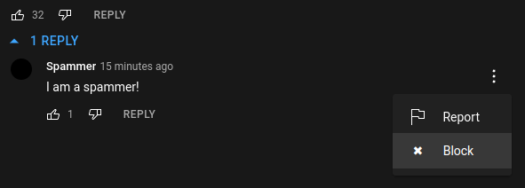
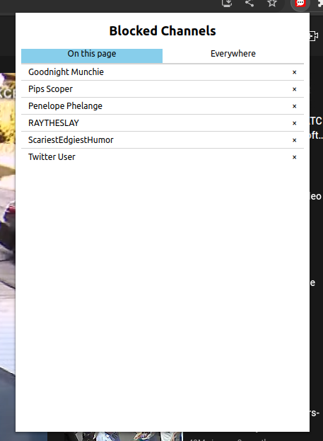

# YouTube Comment Blocker 

|Drop-down Menu | Popup |
|-|-|
|  |  |

# Features

- Block/unblock users
- View which users are blocked globally, or on the current page

This is an **extremely** simple extension written in pure JavaScript. It's under
300 lines of code and no minifiers or bundlers are needed.
